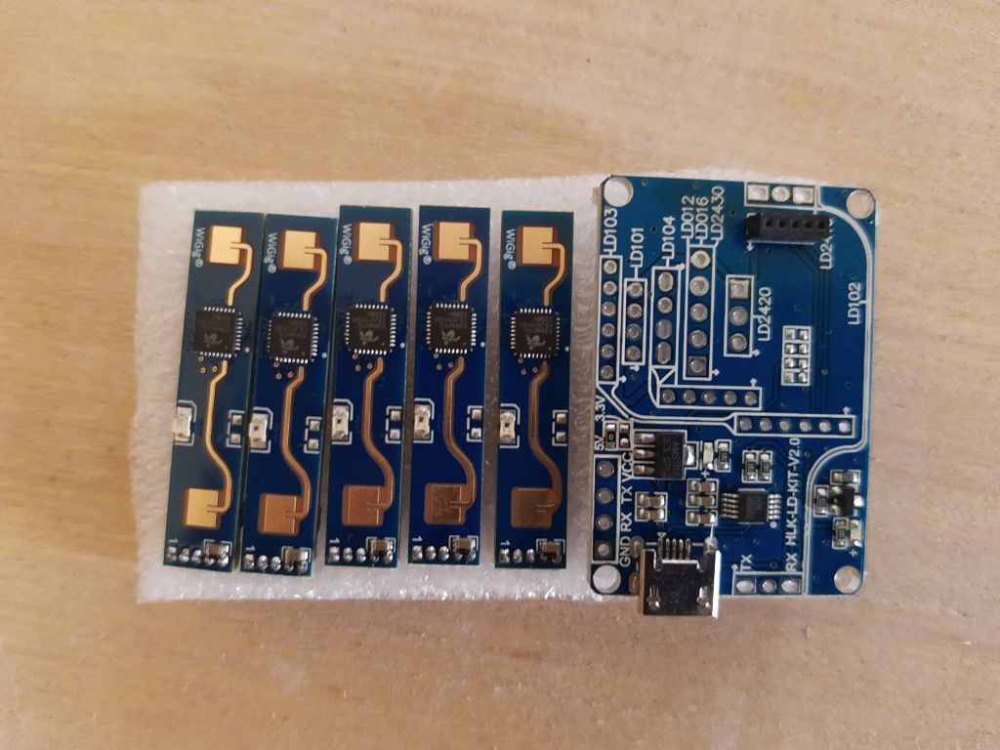
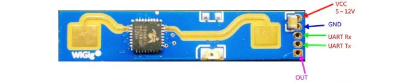

# LD2410

Arduino library for the Hi-Link **LD2410**, **LD2410B**, **LD2410C**
and **LD2410S** 24 GHz mmWave presence radars over UART.

> 📚 **Full documentation lives in [`docs/`](docs/)** — start with
> [`docs/README.md`](docs/README.md) for the index, or jump straight to
> [getting started](docs/01-getting-started.md),
> the [variant comparison](docs/02-variants.md), the
> [API reference](docs/04-api-core.md), or
> [troubleshooting](docs/09-troubleshooting.md).



## Variant support

| Variant | Status | Default baud | Gates | Distinctive features |
|---|---|---|---|---|
| **LD2410** (base) | ✅ Supported | 57600 | 9 × 0.75 m | Original — minimal command set |
| **LD2410B** | ✅ Supported, **UNVERIFIED on hardware** | 256000 | 9 × 0.75 m or 9 × 0.20 m | Superset of C: same opcodes + on-board photodiode (`setAuxiliaryControl`) and engineering-frame light-sense/OUT-pin trailer |
| **LD2410C** | ✅ Supported, HW-validated | 256000 | 9 × 0.75 m or 9 × 0.20 m | Bluetooth, MAC, runtime baud, switchable distance resolution |
| **LD2410S** | ⚠ Supported, **UNVERIFIED on hardware** | 115200 | 16 (width not specified by HLK V1.00 — use `detectionDistance()` for absolute distance) | 3.3 V, auto-threshold tuning, generic-parameter set, minimal output frame |

Pick the target at compile time. The simplest route — works on every
build system including the Arduino IDE GUI — is to include the variant
entry header instead of `<ld2410.h>`:

```cpp
#include <ld2410c.h>   // or <ld2410b.h> / <ld2410s.h> / <ld2410.h> for base
```

For PlatformIO / arduino-cli you can equivalently pass the macro as a
build flag (`build_flags = -DLD2410_VARIANT_C` /
`--build-property "build.extra_flags=-DLD2410_VARIANT_C"`) and keep
including `<ld2410.h>`. Both routes produce identical binaries; see
[`docs/02-variants.md`](docs/02-variants.md#selecting-the-variant-at-build-time)
for the full comparison.

Methods that don't exist on your variant produce a clean compile error
pointing at the missing `LD2410_HAS_*` flag — no silent runtime fallthrough.

Capability matrix and per-method coverage:
[`docs/02-variants.md`](docs/02-variants.md) +
[`docs/method-coverage.md`](docs/method-coverage.md).

## Quick start

```cpp
#include <ld2410c.h>            // pin variant via entry header

ld2410 radar;

void setup() {
  Serial.begin(115200);
  Serial1.begin(LD2410_DEFAULT_BAUD, SERIAL_8N1, RX_PIN, TX_PIN);
  if (!radar.begin(Serial1)) {
    Serial.println("radar offline");
  }
}

void loop() {
  radar.read();
  if (radar.presenceDetected()) {
    Serial.print("detection at ");
    Serial.print(radar.detectionDistance());
    Serial.println(" cm");
  }
  delay(100);
}
```

> ⚠️ **Wiring note:** the OUT-pin position differs between LD2410 base
> (pin 1) and LD2410C (pin 3); LD2410S also runs at 3.3 V (not 5 V).
> Check the [variant comparison](docs/02-variants.md#hardware-quick-reference)
> before connecting power.



## Examples

| Sketch | Demonstrates |
|---|---|
| [`basicSensor`](examples/basicSensor/basicSensor.ino) | Synchronous `read()` + basic getters. Multi-platform. |
| [`basicSensorEsp8266`](examples/basicSensorEsp8266/basicSensorEsp8266.ino) | Same on ESP8266 with SoftwareSerial. |
| [`autoReadTask`](examples/autoReadTask/autoReadTask.ino) | FreeRTOS background reader on ESP32. |
| [`setupSensor`](examples/setupSensor/setupSensor.ino) | Configuration writes (`setMaxValues`, `setGateSensitivityThreshold`). |
| [`engineeringMode`](examples/engineeringMode/engineeringMode.ino) | Per-gate energy via `requestStartEngineeringMode` + atomic snapshots. |
| [`bluetoothControl`](examples/bluetoothControl/bluetoothControl.ino) | LD2410C-only: Bluetooth on/off, MAC readback, password. |
| [`distanceResolution`](examples/distanceResolution/distanceResolution.ino) | LD2410C-only: 0.75 m ↔ 0.20 m gate quantisation. |
| [`snapshotAtomic`](examples/snapshotAtomic/snapshotAtomic.ino) | ESP32 dual-core race-safe getter pattern. |

## Tests + CI

- **Host suite** (g++ × 4 variants): 84 tests covering byte-level
  parser correctness (16 base + 27 B + 22 C + 19 S). Run with
  `bash tests/run.sh`.
- **Compile matrix** (CI): 4 boards × 4 variants = 16 cells, plus
  host job. Boards: `esp32`, `esp8266`, `rp2040`, `avr128da32`
  (SpenceKonde DxCore — only 8-bit MCU in the matrix, guards against
  implicit `int=32` assumptions). Run locally with
  `bash tests/compile_matrix.sh`.
- **Hardware**: full-API sweep at
  [`tests/hw/ld2410c_full_test`](tests/hw/ld2410c_full_test/) — **28/28
  PASS** on bench LD2410C (validated on 2026-05-17 after the
  header-only refactor, against both the legacy macro pattern and
  the new `<ld2410c.h>` entry-header pattern). Interactive 4-mode
  switcher at [`tests/hw/ld2410c_modes_switch`](tests/hw/ld2410c_modes_switch/).

## History

Originally based on the [ESPHome LD2410 work by rain931215](https://github.com/rain931215/ESPHome-LD2410)
and the manufacturer datasheet. Released under the LICENSE in this repo.

Release notes: see the [GitHub releases page](https://github.com/ncmreynolds/ld2410/releases).

## Contributing

PRs welcome. Conventions and PR-only workflow are documented in
[`CLAUDE.md`](CLAUDE.md). When adding or removing a method, update
[`docs/method-coverage.md`](docs/method-coverage.md) and the
relevant `docs/0X-api-*.md` page in the same commit.
